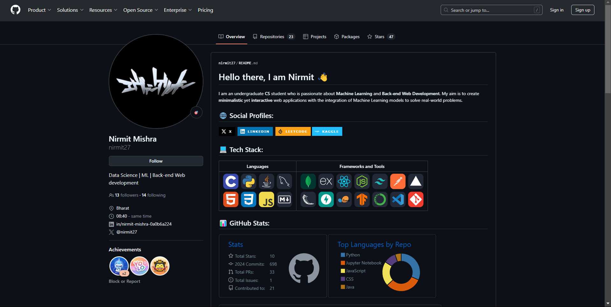

# Link Shortener

This project is a REST API for shortening URLs, built using **Express.js**. The API provides several endpoints for generating short URLs, retrieving original URLs, and managing records.

## Features

- **Shrink long URLs**: Convert long URLs into shorter, 8-character hash codes.
- **Retrieve original URLs**: Fetch the original long URL from the generated short code.
- **Redirect to original URL**: Redirect users to the original URL when they visit a short URL.
- **View all records**: Retrieve a list of all shortened URLs along with their hash codes.

## Endpoints

### 1. **Shrink Long URL**

- **Route**: `POST /shrink`
- **Description**: This route handles POST requests and generates an 8-character hash code for the long URL passed in the request body as JSON.
- **Request Example**:
  ```json
  {
    "longUrl": "https://github.com/nirmit27"
  }
  ```
- **Response Example**:
  ```json
  {
    "shortCode": "58a71bc0"
  }
  ```
  
### 2. **Fetch Long URL**

- **Route**: `GET /url/:code`
- **Description**: This route returns the original long URL corresponding to the 8-character hash code sent as the query parameter.
- **Request Example**: `GET /url/abc12345`
- **Response Example**:
  ```json
  {
    "longUrl": "https://github.com/nirmit27"
  }
  ```
  
### 3. **Visit Long URL**

- **Route**: `GET /visit/:code`
- **Description**: This route redirects the user to the webpage whose URL corresponds to the 8-character hash code passed as the query parameter.
- **Request Example**: `GET /visit/abc12345`
- **Response Example**:
  
  
  
  
### 4. **All Records**

- **Route**: `GET /all`
- **Description**: This route lists all the long URLs along with their corresponding hash codes.
- **Request Example**:
  ```json
  {
    "url": "https://www.example.com/very/long/url"
  }
  ```
- **Response Example**:
  ```json
  [
    {
      "longUrl": "https://www.example.com/very/long/url",
      "shortCode": "abc12345"
    },
    {
      "longUrl": "https://www.anotherurl.com/",
      "shortCode": "xyz98765"
    }
  ]
  ```

## Installation and Setup

1. **Clone the repository**:
   ```bash
   git clone https://github.com/username/link-shortener.git
   cd link-shortener
   ```

2. **Install dependencies**:
   ```bash
   npm i
   ```

3. **Run the server**:
   ```bash
   node index.js
   ```
   The server **should** start at `http://localhost:3000` if you have followed along.

## Technologies Used

[](https://nodejs.org/en)&nbsp;
[](https://expressjs.com/)&nbsp;
[](https://www.mongodb.com/)&nbsp;
[](https://vercel.com/)


  
